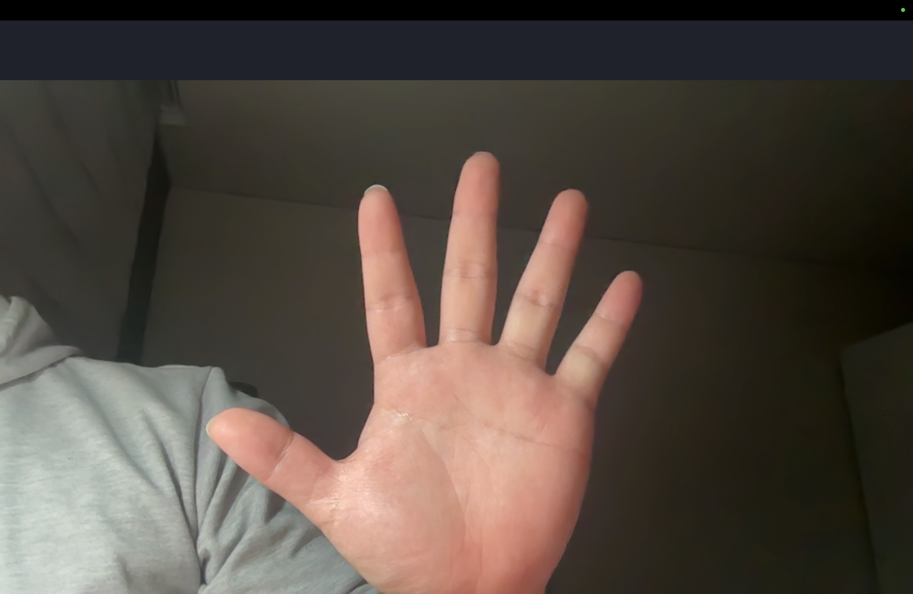

Mac 모델: MacBook Air M3 (Apple Silicon)
OS 버전: macOS Sequoia 15.0
Python 버전: 3.11.9

설치한 라이브러리:

- opencv-python
- numpy
- torch (MPS 지원)
- scikit-learn
- pyautogui

가상환경 경로: ~/project/venv
카메라 미리보기 정상 작동 (미러 OFF)

